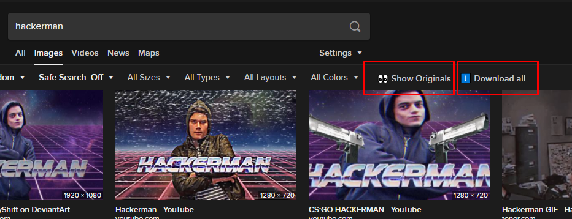
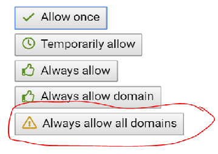

# [DuckDuckGo-Enhancer](https://github.com/FarisHijazi/DuckDuckGo-Enhancer) UserScript

This script adds features to [DuckDuckGo.com](https://DuckDuckGo.com) image search.

## Features

- button to show original **fullres** images (instead of showing thumbnails)
- button to **download all images**

## Installation

The script is installed as a *UserScript*, and a UserScript client must be installed.

1. Install [Tampermonkey](install:tampermonkey-chrome) (
  [chrome](install:tampermonkey-chrome),
  [firefox](install:tampermonkey-firefox),
  [edge](install:tampermonkey-edge),
  ) for your browser (or any other [UserScript client][guide:get-user-script]).
1. Click [DOWNLOAD][download-link] (or visit the RAW file url).
2.  

    
Allow downlaods. (Optional) <i>(Click to expand)</i>

    <ul>
    <li>
    <a href="https://www.tampermonkey.net/faq.php#Q302">Enable <code>Browser API</code>.
       
      
    </a>
     
    <ul>
      <li>Go to the Tampermonkey options page</li>
      <li>Scroll down to the <i>Downloads</i> section</li>
      <li>Double-check the <i>Whitelisted File Extensions</i> setting to not contain file extensions of executable files</li>
      <li>Select <i>Browser API</i> at the <i>Download Mode</i> option</li>
      <li>A notification may come up, you need to click at it and to click <i>confirm</i> at the permission grant dialog</li>
    </ul>
    </li>
    <li>When prompted, allow the script to load images, click <code>Always allow all domains</code> (only needed once).  </li>
    </ul>
    

3. Open any [DuckDuckGo image search page](https://duckduckgo.com/?q=hackerman&atb=v73-5__&iar=images&iax=images&ia=images) and enjoy the enhanced experience

## Todo

- [x] make independent repo
- [x] `download all images` button, add a number next to it that shows how many images will be downloaded
- [ ] add download button when viewing image (in image panel)
- [ ] fix highlighting imageboxes (the border colors aren't being highlighted correctly)
- [ ] fix tutorial/structure.md

### Libraries

- [jQuery](https://jquery.com/)
- [Mousetrap.js](https://github.com/ccampbell/mousetrap) keybindings
- [progressbar.js](https://github.com/kimmobrunfeldt/progressbar.js/) progress bar when downloading
- [JSZip](https://github.com/Stuk/jszip) zip and compress functionality

## Contributing

- Fork it!
- Create your feature branch: `git checkout -b my-new-feature`
- Commit your changes: `git commit -am 'Add some feature'`
- Push to the branch: `git push origin my-new-feature`
- Submit a pull request!

## License

Apache License  
Version 2.0, January 2004

[guide:get-user-script]: https://openuserjs.org/about/Userscript-Beginners-HOWTO#how-do-i-get-going-
[guide:userscript]: https://simply-how.com/enhance-and-fine-tune-any-web-page-the-complete-user-scripts-guide#section-2
[guide:browser-API-beta]: https://www.tampermonkey.net/faq.php#Q302
[guide:browser-API-beta-gif]: https://www.tampermonkey.net/images/animated/gm_download.gif
[download-link]: https://github.com/FarisHijazi/DuckDuckGo-Enhancer/raw/master/DuckDuckGo-Enhancer.user.js
[install:tampermonkey-chrome]: https://www.tampermonkey.net/index.php?ext=dhdg&browser=chrome
[install:tampermonkey-firefox]: https://www.tampermonkey.net/index.php?ext=dhdg&browser=firefox
[install:tampermonkey-edge]: https://www.tampermonkey.net/index.php?ext=dhdg&browser=edge

[chrome-icon]: https://imgur.com/3C4iKO0.png
[firefox-icon]: https://imgur.com/Dy442GK.png
[edge-icon]: https://imgur.com/RlmwPGO.png
[opera-icon]: https://imgur.com/nSJ9htU.png
[safari-icon]: https://imgur.com/ENbaWUu.png
[webbrowser-icon]: https://imgur.com/EuDp4vP.png
[brave-icon]: https://imgur.com/z8yjLZ2.png
[torr-icon]: https://imgur.com/uhb8M86.png
